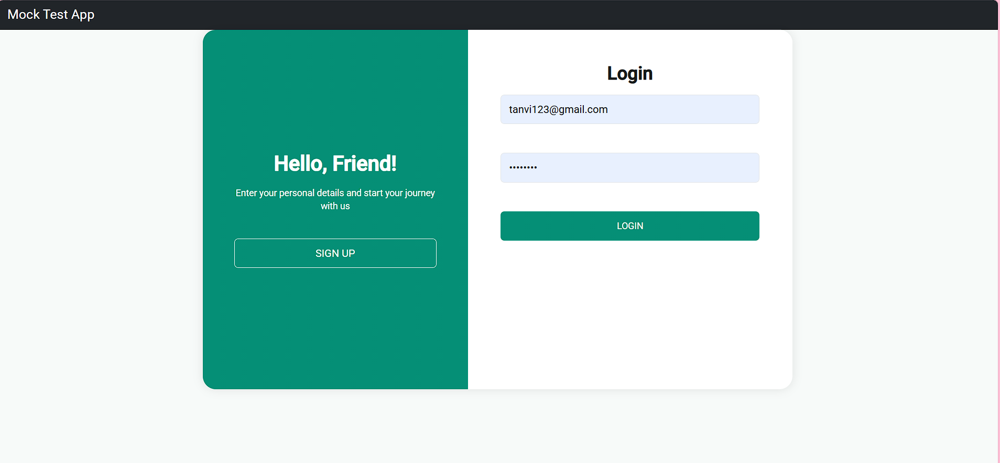
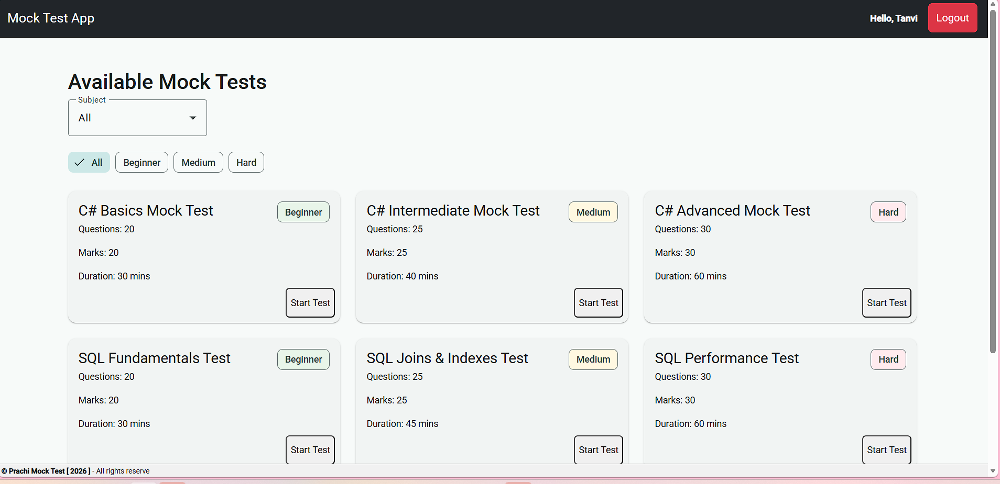
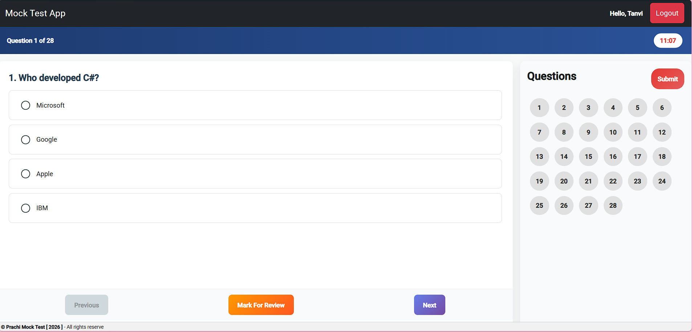
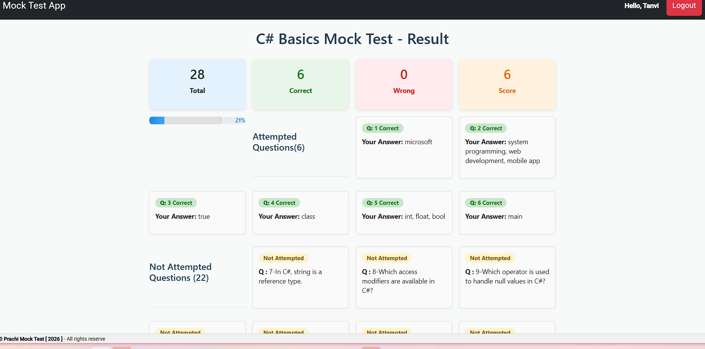

# Online Mock Test Application


##  Overview
The Online Mock Test Application is a full-stack web application that allows users to log in, select a test, attempt quiz questions, and view their results after submission.

The application is built using **Angular for the frontend** and **ASP.NET Web API for the backend**, providing a smooth and interactive quiz experience.

---

##  Features

- User Login
- Test selection from available quizzes
- Questions displayed one by one
- Option to select an answer
- Option to skip questions
- Submit test functionality
- Result page displaying:
  - Total score
  - Correct answers
  - Wrong answers
  - Non-attempted questions

---

##  Tech Stack

### Frontend
- Angular
- TypeScript
- HTML
- CSS
- Bootstrap

### Backend
- ASP.NET Web API
- C#

### Tools & Platforms
- Visual Studio Code
- Visual Studio
- Git
- GitHub

---

## Architecture

User interacts with the Angular frontend which communicates with the backend API.  
The ASP.NET Web API processes requests and returns the required data.

+-------------+
|    User     |
+-------------+
        |
        v
+------------------+
|  Angular Frontend|
+------------------+
        |
   HTTP Requests
        |
        v
+----------------------+
|  ASP.NET Web API     |
+----------------------+
        |
        v
+----------------------+
|     Database         |
+----------------------+


##  Application Workflow

1. User opens the application.
2. User logs in using their credentials.
3. After successful login, the **Home Page** appears.
4. User selects a test from the available list.
5. User clicks **Start Test**.
6. Questions are displayed one by one.

User can:
- Select an answer
- Skip the question

7. After completing the quiz, the user clicks **Submit**.
8. The application processes the responses.
9. The **Result Page** displays:
   - Total Score
   - Correct Answers
   - Wrong Answers
   - Non-Attempted Questions

---

##  API Endpoints

### Authentication

POST /api/login  
Authenticate user and return login response.

### Get Tests

GET /api/tests  
Fetch available tests for the user.

### Get Questions

GET /api/questions/{testId}  
Retrieve questions for selected test.

### Submit Quiz

POST /api/submit  
Submit answers and calculate result.

### Get Result

GET /api/result/{userId}  
Fetch quiz result details.

##  Frontend–Backend Interaction

- Angular sends API requests to the **ASP.NET Web API**.
- The Web API processes the request and returns quiz data.
- Angular displays questions and submits answers.
- The backend evaluates the answers and returns the result.

---

##  Screenshots

###  Login Page
<p align="center">
  
</p>

###  Home Page
<p align="center">
  
</p>

###  Quiz Page
<p align="center">
  
</p>

###  Result Page
<p align="center">
  
</p>


---

##  Future Improvements

- Add quiz timer
- Store results in database
- Admin panel for managing quizzes
- Detailed performance analytics

---

##  Installation & Setup

### 1️. Clone the Repository

## Project Repositories
Frontend (Angular)  
```bash
git clone https://github.com/prachikat123/mocktest-ui.git
```
Backend (ASP.NET Web API) 
```bash
git clone https://github.com/prachikat123/mocktest-api.git
```


### 2️. Run Backend (ASP.NET Web API)

1. Open the backend project in **Visual Studio**
2. Build and run the Web API

---

### 3️. Run Frontend (Angular)

Install dependencies
```bash
npm install
```

Run the Angular application
```bash
ng serve
```

Open in browser
```bash
http://localhost:4200
```


---

##  Key Learnings

During the development of this project, I gained practical experience in:

- Building a full-stack application using Angular and ASP.NET Web API
- Creating reusable Angular components
- Handling API calls from Angular to the backend
- Managing quiz state and user responses
- Implementing result calculation logic
- Using Git and GitHub for version control

##  Challenges Faced

Some challenges encountered during development:

- Managing quiz state while navigating between questions
- Handling skipped and non-attempted questions correctly
- Integrating Angular frontend with ASP.NET Web API
- Displaying accurate quiz results after submission
- Debugging API response handling in Angular


##  Author

**Prachi Sonkusare**  
Angular & .NET Developer


